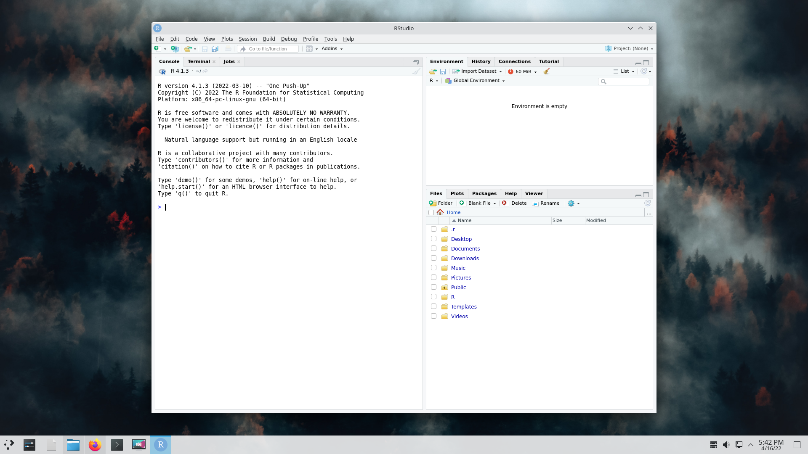

# Table of Contents

1.  [What is R?](#org88bf26b)
2.  [Install Git](#org6dff171)
3.  [Installing and using  R and RStudio](#org73ab150)

Short URL: [bit.ly/biostats218](http://bit.ly/biostats218)

This is the GitHub repository (repo) for Biol/Math 218

Instructor: Matthew Lundquist

Office: Carson 603

If you are new to GitHub, you should check out this 
[blog post by Lauren Orsini](http://readwrite.com/2013/09/30/understanding-github-a-journey-for-beginners-part-1).
However, you only need to know how to download content from the
repo.

We will utilize the built-in capabilities of RStudio to interface directly with this
GitHub repository using the git version control software.

All lessons, examples, and assignments will be under labeled
sub-directories in the repository. For each folder, there will be
a `.rmd` file with all the information you need as well as any data or
supplementary material.

# What is R?

R is a statical software environment for the analysis of data and the
production of graphics (R-project.org). Using R can be daunting for
the uninitiated because it is entirely command-line based. However, 
this is the greatest strength that R has because 
it is extremely flexible, customizable, and (for most things) fast. R
is also free and open-source, meaning that there are a lot of 
people out there that maintain the project and write 
specific statistical packages. There are plenty of other programs
(SAS, SPSS, MATLAB, Excel) that you can use to do data 
analysis but they are expensive and less customizable. 
There are other software environments out there too (Python, Julia)
for those who need a little more speed and flexibility. R brings to the table some very
powerful analysis and graphics production tools in a package that is pretty
easy to use, once you get the hang of it. It is an attractive program for
students and professionals alike and is continuing to grow in interest and
complexity. Skills in data analysis with R is now becoming a must for many looking 
for graduate or professional positions and is a great addition to a
resumé.

 [Tutorial Videos](http://www.lundquistecology.com/videos/r-tutorials)

# Install Git

Whether you are using MacOS, Windows, or Linux, you will need to
download Git.

linux:

Download [Git for MacOS](https://git-scm.com/download/mac) and just
follow the prompts.

Windows:

Download [Git for Windows](https://git-scm.com/download/win) and
follow the prompts. The default settings should work fine.

Ubuntu: 

Open Terminal and type:

    sudo apt-get update
    sudo apt-get install git

Thats it, now you have Git!

# Installing and using  R and RStudio

These are the instructions for Linux, but they should be similar to
what you need to do in Windows or MacOS

**<ins>CLICK ON IMAGES FOR LARGER VERSIONS</ins>**

1.  Download latest version of `R` from
    [cran.r-project.org](https://cran.r-project.org)
2.  Download the latest version of `RStudio` from 
    [www.RStudio.org](https://www.rstudio.com/products/rstudio/download/)
3.  Open RStudio.app 
    
4.  Navigate to `File > New Project...`
    
5.  Choose `Version Control`
    
6.  Choose `Git`
    
7.  Set `Repository URL: https://github.com/lundquist-ecology-lab/biostats`
    and set the `Project directory name: biostatistics` and 
    set the projet subdirectory as `~/Documents/biostatistics` (or whatever directory you want to
    use) then select `Create Project`
    
8.  At this point RStudio should download everything from this GitHub
    repository into your project directory (bottom right).
    
9.  You can now navigate folders directly in
    RStudio. For example: Open `porfolios` and it will open
    the portfolios folder
    
10.  You can also open `.r` files, including the portfolios and other assignments. RStudio
    will open an `Editor` window on the `Top Left` panel
    
11.  These files can be edited, tested with the `-> Run` command and saved within your project directory
12.  Once you are done editing and testing your porfolios, the `.r` files can be [uploaded to Brightspace](https://mmm.brightspace.com/d2l/home/15700).

When in doubt, you can also get the files off of GitHub by downloading them
manually. To do this:

1.  Click on the folder that contains the file you are interested in.
2.  Click on the file you are interested in downloading.
3.  On the top right corner you will see a button that reads `Raw`.
4.  Right click on `Raw` and select "Save Linked File"
5.  Depending on your browser, it will either download automatically or you can choose where to download it on to your machine.
6.  You should now be able to read and edit the file.

