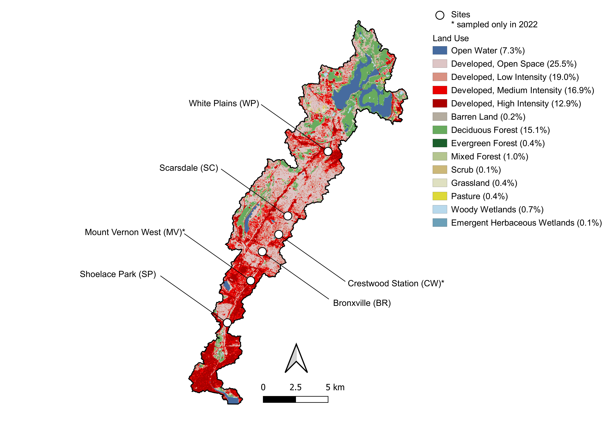

# Day 1

Today we will be using summary statistics to describe data sampled from a 
real-world population. 

## Part 1: Mean and standard deviation

Below is an example calculation of the **mean**, which is 
the average measurement from the sample, and the **variance** and 
**standard deviation**, which describe the spread of the measurements. 
Both are important for accurately describing data. 

```{r mean_and_sd}
# Sample mean (arithmetic mean)
y <- c(5, 3, 2, 6, 4, 3)
n <- length(y)

y_bar <- sum(y) / n

print(y_bar)

# Check using the built-in function
mean(y)

# Sample variance and standard deviation

# Variance
SS <- sum((y - y_bar)^2) # Sum of squares

s2 <- SS / (n - 1) # Using n - 1 corrects for bias

print(s2)

# Check using the built-in function
var(y)

# Standard deviation
s <- sqrt(s2)

print(s)

# Check using the built-in function
sd(y)
```

**Important: Any rounding should only be done at the end. Do not round intermediate calculations.**

### Practice problem 01: mean, variance and standard deviation

We will be looking a dataset collected by a fellow Marymount Manhattan student. She
was interested in whether there was an effect of urbanization in different sites
in the [Bronx River](https://en.wikipedia.org/wiki/Bronx_River) on the size of
*Hydropsyche* sp., an important food source for fish in the river.


To do this, she measured each larvae from the tip of the head to the tip of the
tail in `mm` using a microscope.

In the code block below do the following:

1. Import "body_length.csv" as "b_len"
2. Explore the data using `names` and `head()` and take note of the **column names**
3. Identify the numerical and categorical variables
4. Calculate the mean larva body length using the mean equation
5. Check your answer to #4 by using the `mean()` function
6. Calculate the variance and standard deviation of the larva body length using the mean equation
7. Check your answer to #6 by using the `var()` and `sd()` functions 

```{r practice_problem_1}
```

**Q01**: What are the numerical and what are the categorical variables?

`Q01 answer:`

**Q02**: What is the sample mean, variance and standard deviation of this insect larva data?

`Q02 answer:`

### Aside 01: Changing scale

Sometimes you need to change the scale of a particular measurement. For example,
you might have measurements using the Metric system, but you have colleagues who
are not scientists and  would like your results reported in the imperial system.
You can change the data scale very easily in R, you just need to use the proper
conversion formula `y' = c * y`. 

```{r mm to inch}
mm_data <- c(10, 11, 23, 32, 12, 15)
c <- 0.039 # a constant
inch_data <- c * mm_data
sd(inch_data)
print(inch_data)
```

Sometimes, you need to convert something like variance, which
is s<sup>2</sup>, so therefore the constant must be c<sup>2</sup>.

```{r sd_conversion }
mm_var <- var(mm_data)
c2 <- 0.039^2
inch_var <- c2 * mm_var
print(inch_var)
```

## Part 2: Median and interquartile range

The **median**, like the mean, describes the measurements in the middle of a 
frequency distribution. The **interquartile range** (IQR), or the middle 50% of the
values in the data measures the spread of the measurements, similarly to standard
deviation.

```{r,  median_and_iqr}
# Sample median
y <- c(5, 3, 2, 6, 4, 3)
n <- length(y)

# We need to sort y from largest to smallest for moth median and IQR
y <- sort(y)
print(y)
# [1] 2 3 3 4 5 6

# Since y has a length of [6],
# we need to take the mean of the numbers at [3] and [4])
med_y <- mean(c(y[3], y[4]))

# Check using the median() function
median()

# Interquartile range

# 1st quartile
j <- 0.25 * n
# j is not an integer so we round up to the nearest integer
j <- ceiling(j)
first_quartile <- y[j]

# 3rd quartile
k <- 0.75 * n
# k is also not an integer so we round up to the nearest integer
k <- ceiling(k)
third_quartile <- y[k]

summary(y)

# Note, if either j or k is an integer, you take the average of the two adjacent
# observations.

#Example, if j = 2, the first quartile is mean(c(y[j], y[j + 1]))

# Check work using the summary() function
summary(y)
```

### Practice problem 02: Median and interquartile range

In the code block below, use your insect length data from `practice_problem_1` and

1. Calculate the median larva body length
2. Calculate the first and third quartile larva body length
3. Check your work using the `summary()` function
   
```{r practice_problem_2}
```

## Part 3: Proportions

For categorical variables, we can calculate the proportion of individuals within
each group. For example, we can calculate the proportion of students in class that
are sophomores using the following equation:

```{r proportions}
sophomores <- 8
class <- 12

p_hat <- sophomores / class
print(p_hat)
```

### Practice problem 03: Proportions

In the code block below, use your insect length data from `practice_problem_1` and

1. Calculate the total number of insects measured
2. Calculate the proportion of insects measured that were from `2021`

# Day 2

Today, we will work together on visualizing our summary statistics from last session

### Practice problem 04: Visualizing mean and SD using histogram  

Using the `b_len` data:

1. Determine the mean body length using the `mean()` function
2. Determine the standard deviation of the body lengths using `sd()`
3. Determine the median body length using `median()`
4. Produce a properly labelled `histogram()` of the body lengths 

```{r histogram}
```

`Question`: What is the shape of the histogram, what does it say about
the mean and the median of the data?

### Practice problem 05: Visualizing differences in means between groups using bar plots

So far, we have been looking at the entirety of the observations, however, there
it is much more interesting to look at potential differences between groups of'
observations. For example, the body length data includes a categorical variable
`site`, which describes the different sites within the Bronx River from where 
the insects were collected.



We can use a function called `summarySE()` from the `Rmisc package` to get summary
statistics from each group. 

We will do this together below:

```{r summary_SE}
library(Rmisc)

# We will fill in the rest in class
```


We can look at the data visually in two ways. We could look at it as a **table**
or as a **bar plot**.

As a table:
```{r summary_SE_table}
library(knitr)
```

As a bar plot:
```{r summary_SE_plot}
libary(ggplot2)
```

`Question 1`: Do you see any differences between the insect lengths between sites?

`Question 2`: Are you sure that the differences you see are real? Why or why not?