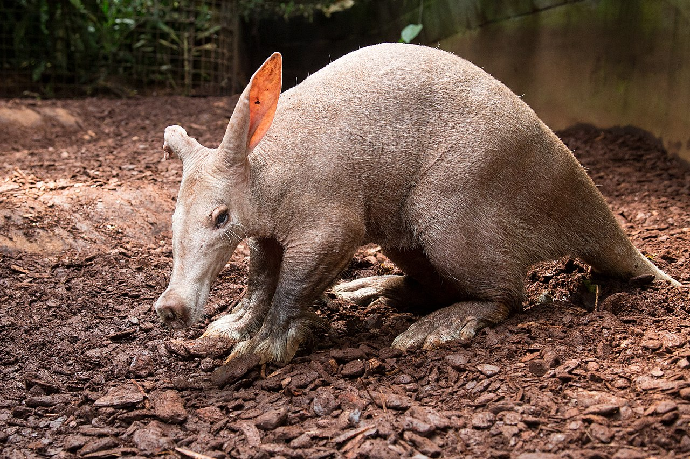

This week, we are going to utilize **chi-squared goodness of fit test**
to decide if a set of observations fit a particular, expected distribution and
how well our observations fit to that expected distribution.

`chi_squared = sum((observed - expected)^2 / expected`

`H_0: The data fits an expected distribution`

`H_A: The data does not fit an expected distribution`

## Example: Mendelian genetics

Gregor Mendel developed the principle of independent assortment, which 
states that alleles will segregate independently into gametes in a 
dihybrid with a phenotypic ratio of **9:3:3:1**. For example, see this dihybrid 
cross table of a BbEe x BbEe hybrid fly. The `B` gene codes for body color 
and the `E` gene codes for eye color. The dominant body color is brown, 
and the recessive color is black, the dominant eye color is red 
and the recessive eye color is brown. See that there are a 9:3:3:1 ratio 
of possible offspring.

|           |     BE      |     Be      |     bE      |     be      |
|-----------|-------------|-------------|-------------|-------------|
|     BE    |     BEBE    |     BEBe    |     BEbE    |     BEbe    |
|     Be    |     BeBE    |     BeBe    |     BebE    |     Bebe    |
|     bE    |     bEBE    |     bEBe    |     bEbE    |     bEbe    |
|     Be    |     beBE    |     beBe    |     bEbE    |     bebe    |

However, we now know that sometimes certain alleles are associated with each 
other, or in other words are not independent. We can test to see if alleles 
are linked using the `chi-squared goodness of fit` test. 

Let's say we take flies that are heterozygous for both the B and E genes. 
We perform `100` dihybrid crosses and  get the following offspring phenotypes:

|     Genotype        |     # individuals    |
|---------------------|----------------------|
|     Brown, red      |     50               |
|     Brown, brown    |     20               |
|     Black, red      |     20               |
|     Black, brown    |     10               |
|                     |     Total = 100      |


We can use the chi-squared test to see if these genes independently assort. 
If we expect a 9:3:3:1 ratio, we can calculate the expected phenotypes 
of the offspring:

|     Genotype        |     # individuals         |
|---------------------|---------------------------|
|     Brown, red      |     9/16 * 100 = 56.25    |
|     Brown, brown    |     3/16 * 100 = 18.75    |
|     Black, red      |     3/16 * 100 = 18.75    |
|     Black, brown    |     1/16 * 100 = 6.25     |
|                     |     Total = 100           |

We can then calculate the chi-square statistic 
using the equation


```{r chi_squared}

chi_squared <- ((50 - 56.25)^2 / 56.25) +
               ((20 - 18.75)^2 / 18.75) +
               ((20 - 18.75)^2 / 18.75) +
               ((10 - 6.25)^2 / 6.25)

print(chi_squared)

## Chi-squared distribution
pchisq(3.11, df = 3, lower.tail = FALSE)

## Check to our results
obs <- c(50, 20, 20, 10)
expect_prob <- c(9 / 16, 3 / 16, 3 / 16, 1 / 16)

chisq.test(obs, p = expect_prob)
```

Note: Chi-squared tests are always `one-tail` tests

## Practice Problem: Fitting a binomial distribution

We can also use the chi-squared test to determine if a set of observations fits
a particular sampling distribution, like the binomial distribution. 

Let's suppose that in aardvarks, front foot hair length is controlled by 
a single gene with two alleles, and let's call them `A` for the dominant allele 
and `a` for the recessive allele. In individuals have at least one `A` allele, 
they have a long front foot hair, but if they have both `a`
alleles, they have a shorter foot hair.



We take a random sample of 230 aardvarks in a national park in Africa and genotype
them. We find that 43 are `AA`, 32 are `Aa`, and 10 are `aa`.    

If having the short hair allele does not impact fitness (survival and reproduction), 
then individuals  with 0, 1, or 2 copies of the "b" allele should follow a 
binomial distribution.

Test this using the chi-squared goodness of fit test.

`Hypotheses`

```{r chi_squared_aardvarks}
```