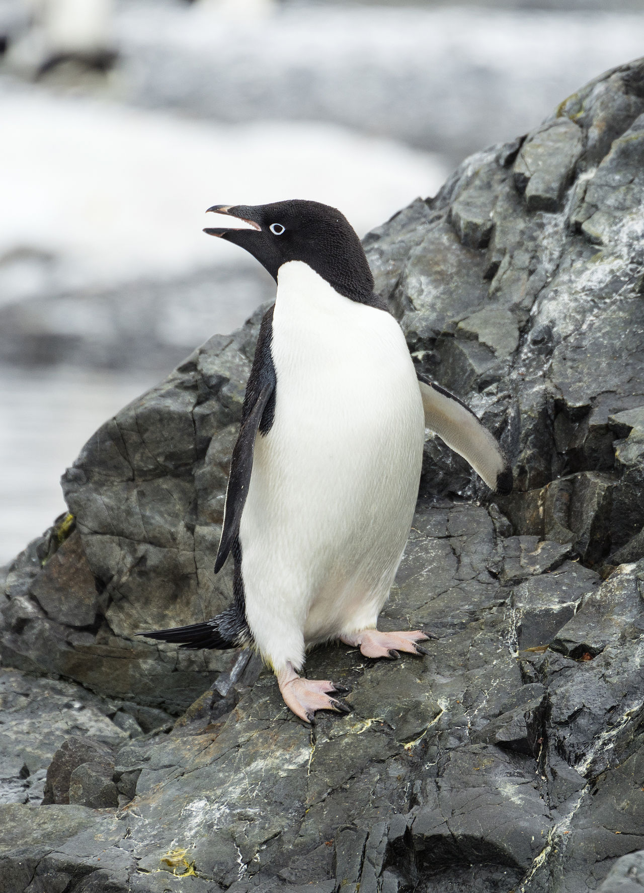
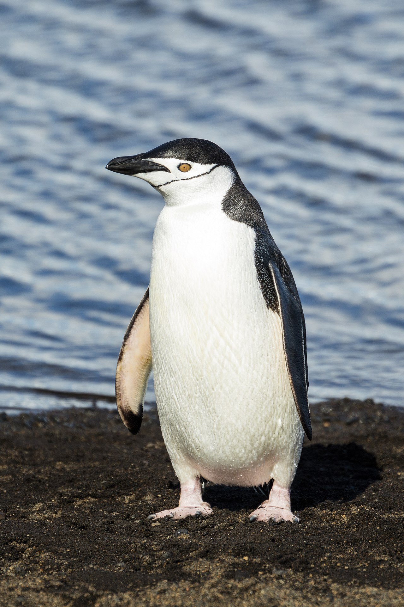
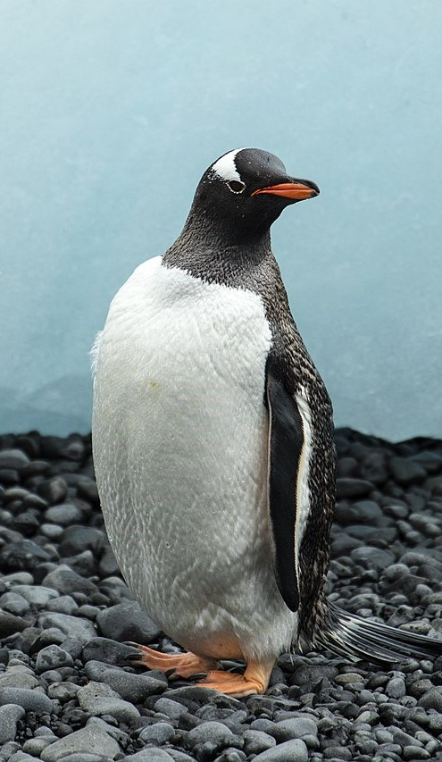

## Part I: Introduction to the analysis of variance

We can use the **analysis of variance (ANOVA)** is a special type of non-parametric 
test used to compare means between normally distributed populations from more 
than groups.

**Hypotheses**

`H_{0}: \mu_{1} = \mu_{2} = \mu_{i} `

`H_{A} : \text{at least one } \mu_{i} \text{ is different}`

**Assumptions**

- Samples are taken randomly
- Measurements from each population is normally distributed
- The variances are equal between all populations

**Equation**

`F = \frac{MS_{groups}}{MS_{error}}`

We need to break down the ANOVA test statistic equation down multiple levels
to properly calculate F. 

## Part II: Calculating F

Let's say we are interested in testing whether the bill lengths of the three
species of penguins in the `PalmerPenguin` data are the same. This is a perfect
opportunity to use an ANOVA.

**Hypotheses**

`H_{0}: \mu_{1} = \mu_{2} = \mu_{i} `

`H_{A} : \text{at least one } \mu_{i} \text{ is different}`

**NOTE**: Unlike previous .Rmd examples, we are doing the ANOVA step by step.
Therefore, each code chunk needs to be run in order, one after the other. 
**They are numbered starting with 00**. 

### Step 00: Download data and subset into groups of interest

```{r 00_anova_data}
library(palmerpenguins)
data(penguins)

penguins <- na.omit(penguins)

levels(penguins$species)

adelie <- penguins$bill_length_mm[penguins$species == "Adelie"]
chinstrap <- penguins$bill_length_mm[penguins$species == "Chinstrap"]
gentoo <- penguins$bill_length_mm[penguins$species == "Gentoo"]
```

For reference:

**Adelie penguin**:


**Chinstrap penguin**:


**Gentoo penguin**:


### Step 01: Partition the sum of squares

Sum of Squares:
`SS_{total} = SS_{error} + SS_{groups}`

Grand mean:
`\bar{Y} = \frac{\sum_{i}n_{i}\bar{Y}_{i}}{N}`

`SS_{groups} = \sum_{i}n_{i}(\bar{Y}_{i} - \bar{Y})^{2}`

`SS_{error} = \sum_{i}\sum_{j}(Y_{ij} - \bar{Y}_{i})^{2}`
or
`SS_{error} = \sum_{i}s_{i}^{2}(n_{i} - 1)`

```{r 01_SS_example}
# Grand mean
y_ad <- mean(adelie)
n_ad <- length(adelie)

y_ch <- mean(chinstrap)
n_ch <- length(chinstrap)

y_go <- mean(gentoo)
n_go <- length(gentoo)

big_N <- n_ad + n_ch + n_go

y_bar <- ((n_ad * y_ad) + (n_ch * y_ch) + (n_go * y_go)) / big_N

## SS_groups

SS_groups <- (n_ad * (y_ad - y_bar)^2) +
             (n_ch * (y_ch - y_bar)^2) +
             (n_go * (y_go - y_bar)^2)

print(SS_groups)

## SS_error

v_ad <- var(adelie)
v_ch <- var(chinstrap)
v_go <- var(gentoo)

SS_error <- (v_ad * (n_ad - 1)) +
            (v_ch * (n_ch - 1)) +
            (v_go * (n_go - 1))

print(SS_error)

## SS_total

SS_total <- SS_error + SS_groups

print(SS_total)
```

### Step 02: Calculate mean squares

MS_groups:
`MS_{groups} = \frac{SS_{groups}}{df_{groups}`

`df_{groups} = k - 1`

MS_error:

`MS_{error} = \frac{SS_{error}}{df_{error}}`

`df_{error} = N - k`

`N = \sum n_{i}`

```{r 02_MS_example}
k <- 3
df_groups <- k - 1

MS_groups <- SS_groups / df_groups

print(MS_groups)

df_error <- big_N - k

MS_error <- SS_error / df_error

print(MS_error)
```

### Step 03: Build ANOVA table

```{r 03_stats_and_table_example}
f_value <- MS_groups / MS_error

print(f_value)

p_value <- pf(f_value, df_groups, df_error, lower.tail = FALSE)

print(p_value)
```

| Source of variation | Sum of squares | df  | Mean Squares | F     | P      |
|---------------------|----------------|-----|--------------|-------|--------|
| Species             | 7015.4         | 2   | 3507.7       | 397.3 | <0.001 |
| Error               | 2913.5         | 330 | 8.8          |       |        |
| Total               | 9928.9         | 332 |              |       |        |

Here we can see that P < 0.05, therefore we **reject the null**, at least one species` 
mean bill length is different than the others. 

### Step 04: Calculating effect of group on observations

We can calculate the overall effect of the grouping variable on the variation 
observed in our data. We do that by calculating `R^2`

R^2:

`R^{2} = \frac{SS_{groups}}{SS_{total}}`

```{r 04_R_squared}
r_squared <- SS_groups / SS_total
print(r_squared)
```

Our `R^2` is 0.707, so we can say that 70.7% of the variation we observe in the
bill lengths is explained by species membership. 

### Step 05: The anova() function

This is the part where we take all that work we did above and put it into 
three lines of code. We can use the `anova()` function, in conjunction with
another function `lm()`, which is the linear model function that we will discuss
in a couple weeks.


```{r 05_anova_function}

# We build a linear model stating our y (bill_length_mm) and 
# our group (species). The tilde "~" should be read as given, 
# so bill length given species is our model
penguin_model <- lm(bill_length_mm ~ species, data = penguins)

# We can use the summary() function to find the R^2 (towards the bottom)
summary(penguin_model)

# We can use the anova() function to build the ANOVA table and calculate P
anova(penguin_model)

# We can also use the aov() function in conjunction with the summary() function
# to build the ANOVA table and calculate P
summary(aov(penguin_model))
```

### Step 06: Post-hoc tests

Our P-value is well under our \alpha of 0.05. Therefore, we 
reject the null and can state that there is evidence that at least one of the 
bill lengths is different between species. But which one? 

We can do a post-hoc test to make individual comparisons between species. The one
we are going to use is called the **Tukey-Kramer** test.

```{r 06_Tukey_test}
# We need to use the aov() function instead of anova()
TukeyHSD(aov(penguin_model))
```

The output is pretty lengthy, but if we look just at `p adj`, we can see that 
for all comparisons of species, P < 0.05. This means that all of the means are 
significantly different from each other. We use an adjusted P value because when 
doing multiple comparisons, **Type I error rate goes up**. The adjusted P 
takes that into account, likely dividing the calculated P value by the 
number of tests (in this case, three).

## Step 07: Check assumptions

We can check the assumptions similarly to the two sample t-test, however, for
normality we are interested in the normality of the residuals (error) instead
of the individual data points. We can use what is called a Q-Q plot to test 
normality. This functionality is built into R.

```{r 07_01_normality_check}
par(mfrow = c(2, 2)) # R will give us four plots to look at
plot(penguin_model)
```

1. Residuals vs Fitted: If you do not see any distinct shape, it is good to go!
2. Normal Q-Q: This is the most important, if the points (residuals) fit closely to the line, we can say the residuals are normally distributed 
3. Scale-Location: If you do not see any distinct shape, it is good to go!
4. Residuals vs Leverage: If you do not see any distinct shape, it is good to go!

**Note**: There is more to these plots than what is given here, feel free to look up
more information if you want to.

```{r 07_02_variance_check}
# We can use Levene's test
library(car)
leveneTest(bill_length_mm ~ species, data = penguins)

# We can also use Bartlett's test
bartlett.test(bill_length_mm ~ species, data = penguins)
```